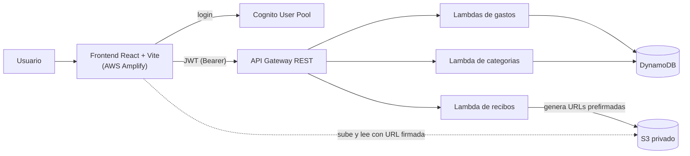

# Expense Tracker

Aplicación full-stack serverless para registrar y analizar gastos personales: autenticación, categorías personalizables, multi-moneda (USD/EUR) y adjuntos de recibos en S3.

**App en vivo:** https://main.d1bfigmggittui.amplifyapp.com

## Funcionalidades
- Registro de gastos (CRUD): monto, moneda, categoría, descripción y fecha.
- Autenticación con Amazon Cognito; cada usuario ve solo sus gastos.
- Categorías: 7 por defecto + personalizadas (crear / editar / borrar).
- Multi-moneda USD/EUR: cada gasto guarda su moneda y los totales se convierten a la moneda elegida con tipo de cambio en vivo.
- Recibos: una imagen por gasto, en un bucket S3 privado vía URLs prefirmadas.
- Dashboard: total del mes, top de categorías y gráfico de los últimos 6 meses.
- Filtros por categoría y rango de fechas, y exportación a CSV.

## Arquitectura


Decisiones de diseño en [DECISIONS.md](./DECISIONS.md).

## Stack
- **Backend:** AWS SAM, Lambda (Node.js 22, TypeScript), API Gateway (REST), DynamoDB (on-demand), Cognito, S3.
- **Frontend:** Vite, React, TypeScript, Tailwind CSS, AWS Amplify (hosting + auth).
- **Tipo de cambio:** API Frankfurter (BCE), con valor de respaldo.

## Estructura del repo
```
expense-tracker/
├── backend/                  # AWS SAM
│   ├── template.yaml         # Lambdas, DynamoDB, Cognito, S3
│   ├── hello-world/          # POST   /expenses
│   ├── list-expenses/        # GET    /expenses
│   ├── get-expense/          # GET    /expenses/{id}
│   ├── update-expense/       # PUT    /expenses/{id}
│   ├── delete-expense/       # DELETE /expenses/{id}
│   ├── categories/           # CRUD   /categories
│   └── receipts/             # URLs prefirmadas /receipts
├── frontend/                 # Vite + React + TS + Tailwind
│   └── src/
│       ├── components/       # ExpenseForm, ExpenseList, Dashboard, ...
│       ├── services/         # api, categories, receipts, rates
│       ├── utils/            # categorias, moneda, CSV
│       ├── types/            # tipos compartidos
│       └── amplify.ts        # configuracion de Cognito
└── DECISIONS.md
```

## API
Todas las rutas requieren `Authorization: Bearer <idToken>` de Cognito.

| Metodo | Ruta | Descripcion |
| --- | --- | --- |
| POST | /expenses | Crear gasto |
| GET | /expenses | Listar gastos del usuario |
| GET | /expenses/{id} | Obtener un gasto |
| PUT | /expenses/{id} | Actualizar gasto |
| DELETE | /expenses/{id} | Eliminar gasto |
| GET | /categories | Listar categorias |
| POST | /categories | Crear categoria |
| PUT | /categories/{categoryId} | Actualizar categoria |
| DELETE | /categories/{categoryId} | Eliminar categoria |
| POST | /receipts/upload-url | URL prefirmada de subida |
| GET | /receipts/view-url?key=... | URL prefirmada de lectura |

## Requisitos
- Node.js 22+
- AWS CLI configurado
- AWS SAM CLI

## Backend — build y deploy
```
cd backend
sam build
sam deploy
```
Tras el deploy, anota los Outputs (UserPoolId, UserPoolClientId) para el frontend.

## Frontend — configuracion y ejecucion
```
cd frontend
cp .env.example .env        # luego rellena los valores
npm install
npm run dev                 # desarrollo
npm run build               # produccion
```

La URL base de la API esta definida en los archivos de frontend/src/services/. Por CORS, el frontend solo recibe datos desde el dominio desplegado en Amplify (no desde localhost).

## Variables de entorno (frontend)
Ver `.env.example`:
```
VITE_USER_POOL_ID=us-east-1_xxxxxxxxx
VITE_USER_POOL_CLIENT_ID=xxxxxxxxxxxxxxxxxxxxxx
```

## Despliegue
- Backend: `sam deploy` (CloudFormation).
- Frontend: AWS Amplify, auto-deploy al hacer merge a `main`.

## Limitaciones conocidas
Ver la seccion final de [DECISIONS.md](./DECISIONS.md).
